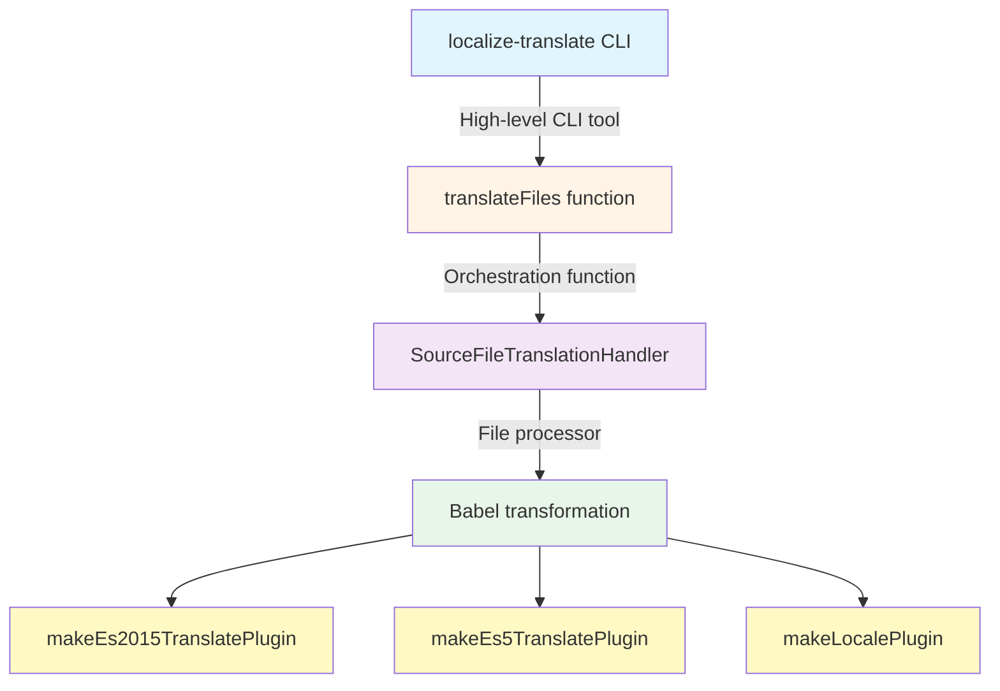
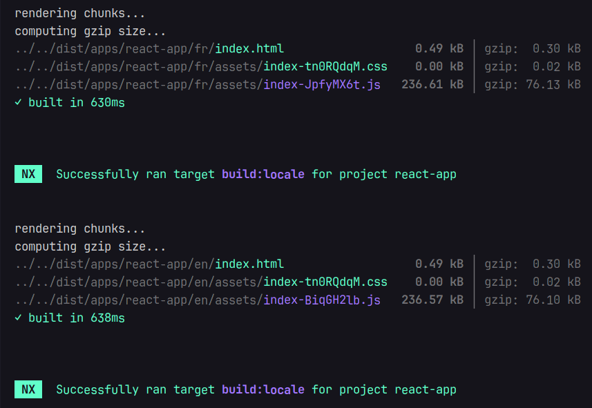

Recently, I worked on [Rosa](https://rosa.be)’s _internationalization_ (i18n) system, I dived deep into the subject so I wanted to share what I learned along the way.

Many tools offer i18n support, but maintaining consistency in large monorepos is essential. At Rosa, we standardized on Angular’s official `@angular/localize` tooling and use it everywhere, regardless of the **framework** or **platform**.

**Why a unified approach matters**: In large monorepos with dozens of apps and libraries, ad-hoc i18n quickly becomes unmaintainable. Standardizing gives:

- **One API** (`$localize`)
- **One transformation engine** (Angular’s Babel plugins)
- **One extraction pattern**
- **One key format** for type safety and validation

## What is Angular localize?

The package provides i18n support using a `$localize` tagged template literal. It marks strings in your code that need translation:

```ts
const message = $localize`Hello, World!`;
```

### Processing scenarios

1. **Build-time (prod)**: Translations are inlined during the build process, producing separate bundles per locale.

```ts
// Source code
const message = $localize`${this.process} is not right`;

// After build-time translation (for French)
const message = '' + this.process + ", n'est pas bon. ";
```

<Note>Build-time translation brings runtime performance benefits by inlining translations and avoiding runtime overhead.</Note>

2. **Runtime**: Translations are loaded and evaluated at runtime, allowing language switching.

```ts
import '@angular/localize/init'; // Side-effect: attaches $localize to globalThis
import { loadTranslations } from '@angular/localize';

loadTranslations({
  greeting: 'Bonjour le monde!',
});

// Outputs 'Bonjour le monde!'
const message = $localize`:greeting:Hello, World!`;
```

<Note>Translations are processed only once, meaning that language switches require a browser refresh.</Note>

3. **Pass-through (dev mode)**: No translation loaded; `$localize` simply evaluates the original template string. This is what happens in development mode by default.

Now that we understand the basics, let's see how to integrate Angular localize with another framework.

## Angular's localize tools for any framework

Before diving into the integration, it's important to note that Angular's i18n tooling is **framework-agnostic** at its core. The transformation logic is encapsulated in Babel plugins provided by `@angular/localize/tools`.

When you write:

```tsx
const title = $localize`:@@welcome.title:Welcome to React`;
```

The transformation process follows this architecture:



1. **`localize-translate` CLI** <br/>
   Entry point for developers and Angular CLI. It parses arguments, loads translation files (XLF, JSON, etc.), resolves source files via globs, and triggers the translation process.

2. **`translateFiles()`** <br/>
   Orchestrates the workflow by selecting the right parsers, creating a `Translator` per locale, running translations in parallel, and collecting diagnostics.

3. **`SourceFileTranslationHandler`** <br/>
   Handles each source file individually: reads it from disk, parses it into an AST, applies locale-specific transformations, and writes the translated output to the correct directory.

4. **Babel transformation (core logic)** <br/>
   Translation happens via three Babel plugins:
   - **`makeLocalePlugin`** replaces `$localize.locale` with the concrete locale (e.g. `"fr-FR"`).
   - **`makeEs2015TranslatePlugin`** transforms `$localize` tagged templates into translated strings for modern JS syntax.
   - **`makeEs5TranslatePlugin`** handles the ES5 `$localize([...])` form emitted by downleveled TypeScript.

<Note type="tip">The beauty of this architecture is that **the same low-level Babel plugins** can be used in any build tool (Webpack, Vite, Rollup, Esbuild) to achieve consistent i18n transformations across frameworks.</Note>

## Integrating with Vite

Creating a Vite plugin is straightforward - it's just a matter of wiring Angular's Babel plugins into Vite's transform pipeline. Let's build it step by step.

### Plugin configuration

First, define the plugin options to make it flexible and reusable:

```ts
import type { Plugin } from 'vite';

export interface LocalizePluginOptions {
  translations?: string | Record<string, any>;
  locale?: string;
  missingTranslation?: 'error' | 'warning' | 'ignore';
  localizeName?: string;
  sourceMaps?: boolean;
}
```

This allows consumers to either provide a path to a translation file or pass translations directly as an object.

### Loading translation files

Angular's `SimpleJsonTranslationParser` handles the heavy lifting of parsing translation files with proper validation:

```ts
import { SimpleJsonTranslationParser } from '@angular/localize/tools';
import * as fs from 'fs';

function loadTranslations(filePath: string) {
  const content = fs.readFileSync(filePath, 'utf-8');
  const parser = new SimpleJsonTranslationParser();

  // First analyze to check if the file is parseable
  const analysis = parser.analyze(filePath, content);
  if (!analysis.canParse) {
    throw new Error(
      analysis.diagnostics.formatDiagnostics(`Cannot parse ${filePath}`)
    );
  }

  // Then parse using the analysis hint
  const parsedFile = parser.parse(filePath, content, analysis.hint);
  if (parsedFile.diagnostics.hasErrors) {
    throw new Error(
      parsedFile.diagnostics.formatDiagnostics(`Failed to parse ${filePath}`)
    );
  }

  return {
    locale: parsedFile.locale || 'en',
    translations: parsedFile.translations,
  };
}
```

This two-step process ensures we catch parsing errors early with clear diagnostic messages.

### The plugin implementation

Now we can wire everything together into a Vite plugin:

```ts
import { transformAsync } from '@babel/core';
import {
  makeEs2015TranslatePlugin,
  makeEs5TranslatePlugin,
  makeLocalePlugin,
  Diagnostics,
} from '@angular/localize/tools';
import * as path from 'path';

export function angularLocalize(options: LocalizePluginOptions = {}): Plugin {
  const {
    translations = {},
    locale = 'en',
    missingTranslation = 'warning',
    localizeName = '$localize',
    sourceMaps = true,
  } = options;

  let translationsMap: Record<string, any> = {};
  let resolvedLocale = locale;

  return {
    name: 'vite-plugin-angular-localize',
    enforce: 'post', // Run after other transforms

    configResolved(config) {
      // Load translations once during config resolution
      if (typeof translations === 'string') {
        const file = loadTranslations(path.resolve(config.root, translations));
        translationsMap = file.translations;
        resolvedLocale = file.locale;
      } else {
        translationsMap = translations;
      }
    },

    async transform(code, id) {
      // Performance: skip files without $localize
      if (!code.includes(localizeName)) return null;

      // Skip node_modules except @angular/localize runtime
      if (id.includes('node_modules') && !id.includes('@angular/localize')) {
        return null;
      }

      const diagnostics = new Diagnostics();

      const result = await transformAsync(code, {
        filename: id,
        sourceMaps,
        compact: false,
        plugins: [
          makeLocalePlugin(resolvedLocale, { localizeName }),
          makeEs2015TranslatePlugin(diagnostics, translationsMap, {
            missingTranslation,
            localizeName,
          }),
          makeEs5TranslatePlugin(diagnostics, translationsMap, {
            missingTranslation,
            localizeName,
          }),
        ],
      });

      // Surface translation errors and warnings
      if (diagnostics.hasErrors) {
        this.error(
          diagnostics.formatDiagnostics(`Translation errors in ${id}`)
        );
      } else if (diagnostics.messages.length > 0) {
        diagnostics.messages.forEach((msg) => {
          if (msg.type === 'warning') {
            this.warn(`${id}: ${msg.message}`);
          }
        });
      }

      return result ? { code: result.code, map: result.map } : null;
    },
  };
}
```

**Key aspects:**

- **`plugins`** array applies the three Angular Babel plugins
- **`enforce: 'post'`** ensures the plugin runs after TypeScript/JSX transforms
- **`configResolved`** loads translations once at startup for performance

### Usage

With the plugin ready, integrate it into your Vite config. Here's a real-world setup that handles both development and production builds:

```ts
import { defineConfig } from 'vite';
import react from '@vitejs/plugin-react';
import { angularLocalize } from './path/to/plugin';

// Use LOCALE env var for production builds (e.g., LOCALE=fr npm run build)
// In dev, serve a single build and handle locale routing in the app
const locale = process.env.LOCALE || 'en';

export default defineConfig(({ mode }) => {
  const isDevMode = mode === 'development';

  return {
    // In dev: base is '/' (routing handles /en, /fr paths)
    // In prod: base is '/{locale}/' (separate builds per locale)
    base: isDevMode ? '/' : `/${locale}/`,

    plugins: [
      react(),
      angularLocalize({
        translations: `./src/i18n/${locale}.json`,
        locale: locale,
      }),
    ],

    build: {
      // Each locale builds to its own directory
      outDir: `./dist/${locale}`,
    },
  };
});
```

**Development workflow:**

```bash
nx serve react-app  # Single build, serves at http://localhost:4200
                    # App routing handles /en, /fr, etc.
```

**Production builds with Nx:**

In your `project.json`, define separate build targets per locale:

```json
{
  "targets": {
    "build": {
      "executor": "nx:run-commands",
      "outputs": ["{workspaceRoot}/dist/apps/react-app"],
      "options": {
        "commands": [
          "LOCALE=en nx build:locale react-app -c en",
          "LOCALE=fr nx build:locale react-app -c fr"
        ]
      }
    },
    "build:locale": {
      "executor": "@nx/vite:build",
      "outputs": ["{options.outputPath}"],
      "options": {
        "outputPath": "dist/apps/react-app/{configuration}"
      },
      "configurations": {
        "en": {
          "outputPath": "dist/apps/react-app/en"
        },
        "fr": {
          "outputPath": "dist/apps/react-app/fr"
        },
        "development": {
          "mode": "development"
        },
        "production": {
          "mode": "production"
        }
      }
    }
  }
}
```

Then build all locales at once:

```bash
nx build react-app  # → dist/apps/react-app/en/
                    # → dist/apps/react-app/fr/
```



## Supporting ICU Message Format

One challenge with `@angular/localize` is that ICU expressions are typically handled by Angular's compiler, not by `@angular/localize` itself. For non-Angular frameworks, we need to implement **runtime ICU evaluation**.

### The transformation approach

We can create a custom Babel plugin that detects ICU syntax in `$localize` templates and transforms them into runtime calls:

```ts
function makeICURuntimePlugin(locale: string, localizeName: string) {
  return function ({ types: t }: any) {
    return {
      visitor: {
        TaggedTemplateExpression(path: any) {
          const tag = path.get('tag');
          if (tag.isIdentifier({ name: localizeName })) {
            const quasi = path.node.quasi;

            // Check if template contains ICU syntax
            const hasICU = quasi.quasis.some((q: any) =>
              /[:,]\s*(plural|select|selectordinal)/i.test(q.value.raw)
            );

            if (hasICU) {
              // Extract message ID and build expression map
              const firstPart = quasi.quasis[0].value.raw;
              const idMatch = firstPart.match(/:@@([^:]+):/);
              const messageId = idMatch ? idMatch[1] : '';

              // Build the ICU message string and values object
              // ... (parsing logic)

              // Transform to: $localize._icu(id, message, locale, values)
              path.replaceWith(runtimeCall);
            }
          }
        },
      },
    };
  };
}
```

### Using ICU expressions in React (or any framework)

In your React components, write ICU expressions just like in Angular:

```tsx
export function App() {
  const [itemCount, setItemCount] = useState(0);
  const [minutes, setMinutes] = useState(0);

  return (
    <div>
      <p>{$localize`:@@itemsCount:{${itemCount}:VAR_PLURAL:, plural, =0 {No items} =1 {One item} other {${itemCount}:INTERPOLATION: items}}`}</p>
      <button onClick={() => setItemCount(itemCount + 1)}>
        {$localize`:@@actions.addItem:Add Item`}
      </button>

      <p>{$localize`:@@minutesAgo:{${minutes}:VAR_PLURAL:, plural, =0 {just now} =1 {one minute ago} other {${minutes}:INTERPOLATION: minutes ago}}`}</p>
      <button onClick={() => setMinutes(minutes + 1)}>
        {$localize`:@@actions.addMinute:Add Minute`}
      </button>
    </div>
  );
}
```

### Implementing the ICU runtime

The Babel plugin transforms ICU templates into `$localize._icu()` calls. We implement this function to parse and evaluate ICU syntax:

```ts
import '@angular/localize/init';

// Implement the ICU runtime handler
if (typeof $localize !== 'undefined') {
  ($localize as any)._icu = function (
    messageId: string, // Translation key (e.g., 'itemsCount')
    message: string, // ICU template
    locale: string, // Current locale
    values: Record<string, any> // Runtime values
  ): string {
    // 1. Get translated template for current locale
    const translations = getTranslations(locale);
    const messageToUse = translations[messageId] || message;

    // 2. Parse ICU syntax
    const icu = parseICUMessage(messageToUse);
    if (!icu) return messageToUse;

    // 3. Evaluate with runtime values
    return renderICUMessage(icu, values, locale);
  };
}
```

The ICU parser extracts the structure from templates like `{count, plural, =0 {no items} other {# items}}`:

```ts
export function parseICUMessage(message: string): ICUMessage | null {
  const icuPattern =
    /\{([^,}]+),\s*(plural|select|selectordinal)\s*,\s*(?:offset:\s*(\d+)\s*)?((?:[^{}]|\{[^{}]*\})*)\}/;

  const match = message.match(icuPattern);
  if (!match) return null;

  const [, variable, type, offset, casesStr] = match;
  const cases: Record<string, string> = {};

  // Parse cases: "=0 {no items} =1 {one item} other {# items}"
  const casePattern = /(=\d+|\w+)\s*\{([^}]*)\}/g;
  let caseMatch;

  while ((caseMatch = casePattern.exec(casesStr)) !== null) {
    const [, caseKey, caseValue] = caseMatch;
    cases[caseKey.trim()] = caseValue.trim();
  }

  return { type, variable: variable.trim(), cases, offset };
}
```

And the renderer uses `Intl.PluralRules` for locale-aware plural selection:

```ts
export function renderICUMessage(
  icu: ICUMessage,
  values: Record<string, any>,
  locale: string
): string {
  const value = values[icu.variable];

  if (icu.type === 'plural' || icu.type === 'selectordinal') {
    const numValue = typeof value === 'number' ? value : 0;

    // Check exact match first (=0, =1, etc.)
    const exactMatch = icu.cases[`=${numValue}`];
    if (exactMatch !== undefined) {
      return exactMatch.replace(/#/g, String(numValue));
    }

    // Get plural category using Intl API
    const pluralRules = new Intl.PluralRules(locale, {
      type: icu.type === 'selectordinal' ? 'ordinal' : 'cardinal',
    });
    const category = pluralRules.select(numValue);
    const result = icu.cases[category] || icu.cases['other'] || '';

    return result.replace(/#/g, String(numValue));
  }

  // Handle 'select' type
  return icu.cases[value] || icu.cases['other'] || '';
}
```

With custom Babel transformation and runtime ICU evaluation, `$localize` now handles complex pluralization. The `Intl.PluralRules` API ensures correct plural forms for each locale, whether English's two forms or Polish's five.

## Message extraction with a custom Nx executor

To complete the workflow, we can create a custom Nx executor that extracts `$localize` messages from any framework. The executor leverages Angular's `MessageExtractor` to scan source files and output translation templates.

```ts
import { ExecutorContext } from '@nx/devkit';
import { MessageExtractor } from '@angular/localize/tools';
import * as glob from 'glob';

export default async function runExecutor(
  options: { sourceRoot: string; outputPath: string; format?: 'json' },
  context: ExecutorContext
) {
  const sourceFiles = glob.sync('**/*.{ts,tsx,js,jsx}', {
    cwd: path.resolve(context.root, options.sourceRoot),
    absolute: true,
    ignore: ['**/node_modules/**', '**/dist/**'],
  });

  const extractor = new MessageExtractor(require('@babel/core'), {
    plugins: ['@babel/plugin-syntax-typescript', '@babel/plugin-syntax-jsx'],
  });

  const messages = extractor.extractMessages(sourceFiles);

  // Convert to JSON format
  const translations = {};
  Array.from(messages.values()).forEach((msg) => {
    if (msg.id || msg.customId) {
      translations[msg.id || msg.customId] = msg.text;
    }
  });

  fs.writeFileSync(
    path.resolve(context.root, options.outputPath),
    JSON.stringify({ locale: 'en', translations }, null, 2)
  );

  return { success: true };
}
```

Register the target in `project.json`:

```json
{
  "targets": {
    "extract-i18n": {
      "executor": "@myorg/tools:i18n-extract",
      "options": {
        "sourceRoot": "apps/react-app/src",
        "outputPath": "apps/react-app/src/i18n/messages.json"
      }
    }
  }
}
```

Then extract messages:

```bash
nx extract-i18n react-app
```

This approach provides automated extraction similar to [Angular CLI extract-i18n](https://angular.dev/cli/extract-i18n), but works across any framework in the monorepo.

## Bringing Node.js platform support

While we've focused on browser applications, the same `$localize` approach works for Node.js applications, useful for backend APIs, CLI tools, or server-side rendering.

Unlike browsers where bundlers handle the transformation, **Node.js requires runtime setup**. The goal is to make `$localize` work transparently in server code without manual bundling steps.

### Runtime initialization

Create a setup module that initializes `$localize` and provides helpers for dynamic locale switching:

```ts
// i18n-init.ts
import '@angular/localize/init';
import { loadTranslations } from '@angular/localize';

let currentTranslations = {};
let currentLocale = 'en';

export const setLocale = (locale: string) => {
  currentLocale = locale;
};

export const setTranslations = (translations: Record<string, string>) => {
  currentTranslations = translations;
};

export const initTranslations = () => {
  locale = process.env.LOCALE || 'en';
  const content = JSON.parse(fs.readFileSync(`./assets/i18n/${locale}.json`, 'utf-8'));
  currentTranslations = content.translations;
  loadTranslations(currentTranslations);

  // Override $localize for runtime ICU evaluation
  (globalThis as any).$localize = function(parts: TemplateStringsArray, ...values: any[]) {
    const messageId = parts[0].match(/:@@([^:]+):/)?.[1];
    let message = messageId && currentTranslations[messageId]
      ? currentTranslations[messageId]
      : parts[0].replace(/:@@[^:]+:/, '');

    // Handle ICU plural/select expressions
    if (/\{[^}]+,\s*(plural|select)/.test(message)) {
      const icu = parseICUMessage(message);
      return renderICUMessage(icu, { count: values[0] }, currentLocale);
    }

    return message;
  };
};
```

### Integration with NestJS

For frameworks like NestJS, use middleware to handle locale switching automatically per-request:

```ts
import { Injectable, NestMiddleware } from '@nestjs/common';
import { loadTranslations } from '@angular/localize';
import { setLocale, setTranslations } from '../i18n-init';

import EN from '../i18n/en.json';
import FR from '../i18n/fr.json';

const locales = { en: EN, fr: FR };

@Injectable()
export class I18nMiddleware implements NestMiddleware {
  use(req: any, res: any, next: () => void) {
    // Extract locale from path (e.g., /api/fr, /api/en)
    const pathLocale = req.path.split('/')[2];
    const locale = pathLocale === 'en' || pathLocale === 'fr' ? pathLocale : 'en';

    // Load translations for this request
    const localeData = locales[locale];
    setLocale(locale);
    setTranslations(localeData.translations);
    loadTranslations(localeData.translations);

    next();
  }
}
```

Register the middleware in your module:

```ts
import { Module, NestModule, MiddlewareConsumer } from '@nestjs/common';
import { I18nMiddleware } from './i18n.middleware';

@Module({
  controllers: [AppController],
  providers: [AppService],
})
export class AppModule implements NestModule {
  configure(consumer: MiddlewareConsumer) {
    consumer.apply(I18nMiddleware).forRoutes('*');
  }
}
```

Now your services can use `$localize` directly—translations are already loaded:

```ts
@Injectable()
export class AppService {
  getData(itemCount = 3, minutes = 5) {
    return {
      message: $localize`:@@api.welcome:Hello API`,
      itemsExample: $localize`:@@api.items.count:{${itemCount}:VAR_PLURAL:, plural, =0 {No items} =1 {One item} other {${itemCount}:INTERPOLATION: items}}`,
    };
  }
}
```

Map routes to different locales:

```ts
@Controller()
export class AppController {
  constructor(private readonly appService: AppService) {}

  @Get('en')
  getDataEn() {
    return this.appService.getData('en');
  }

  @Get('fr')
  getDataFr() {
    return this.appService.getData('fr');
  }
}
```

Configure your bundler to copy translation files:

```js
// webpack.config.js
assets: [
  { input: './src/i18n', glob: '*.json', output: 'assets/i18n' }
]
```

Now your API serves localized responses:

```bash
> curl -s http://localhost:3000/api/en | jq
{
  "message": "Hello API",
  "itemsExample": "3 items",
  "timeExample": "5 minutes ago"
}

> curl -s http://localhost:3000/api/fr | jq
{
  "message": "Bonjour API",
  "itemsExample": "3 éléments",
  "timeExample": "il y a 5 minutes"
}
```

<Note>This runtime approach requires no build-time transformation, just load translations and override `$localize` for ICU evaluation.</Note>

## Conclusion

By leveraging `@angular/localize` tooling as a universal i18n foundation, we can build a consistent and robust internationalization system across different **frameworks** and **platforms**.

Because we've standardized on a single i18n approach across our entire monorepo, we can now build upon this foundation and continuously improve the system. Here are some ideas to take it further:

- **Enforce conventions with [Nx Powerpack](https://nx.dev/docs/enterprise/conformance)**: Use conformance rules to validate that all message IDs follow your naming conventions (e.g., `feature.component.message`), ensure ICU syntax is correct, or prevent hardcoded strings in components.

- **Automated translation workflows**: Integrate with translation management systems (like Crowdin or Lokalise) through Nx executors to automatically extract messages, push them for translation, and pull completed translations back into your repository.

- **Type-safe i18n**: Generate TypeScript types from your message IDs to get autocomplete and compile-time validation when using `$localize`, preventing typos and missing translations.

The standardization is what makes all of this possible, once you have a unified system, every improvement benefits the entire organization.

<Note type="tip">Explore the complete implementation with working examples at **[github.com/edbzn/i18n-sandbox](https://github.com/edbzn/i18n-sandbox)**.</Note>

## References:

- [i18n Guide - Angular.io](https://angular.io/guide/i18n)
- [Intl API - MDN](https://developer.mozilla.org/en-US/docs/Web/JavaScript/Reference/Global_Objects/Intl)
- [compiled-i18n - Static i18n support in js bundles](https://github.com/wmertens/compiled-i18n)
