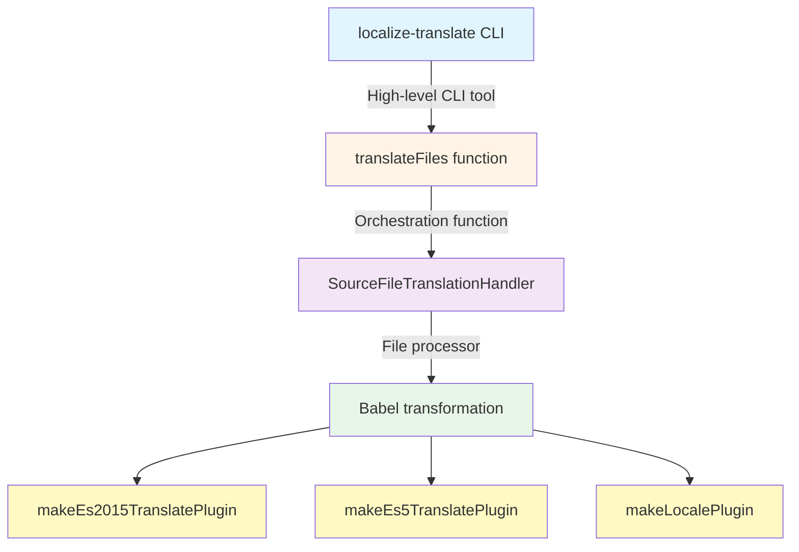

Recently, I worked on [Rosa](https://rosa.be)’s internationalization (i18n) system, and wanted to share what I learned along the way.

Many tools offer i18n support, but maintaining consistency in large monorepos is essential. At Rosa, we standardized on Angular’s official `@angular/localize` tooling and use it everywhere, regardless of the **framework**.

**Why a unified approach matters**: In large monorepos with dozens of apps and libraries, ad-hoc i18n quickly becomes unmaintainable. Standardizing gives:

- **One API** (`$localize`)
- **One transformation engine** (Angular’s Babel plugins)
- **One extraction pattern**
- **One key format** for type safety and validation

## What is Angular localize?

The package provides i18n support using a `$localize` tagged template literal. It marks strings in your code that need translation:

```ts
const message = $localize`Hello, World!`;
```

### Processing scenarios

1. **Build-time (prod)**: Translations are inlined during the build process, producing separate bundles per locale.

```ts
// Source code
const message = $localize`${this.process} is not right`;

// After build-time translation (for French)
const message = '' + this.process + ", n'est pas bon. ";
```

<Note>Build-time translation brings runtime performance benefits by inlining translations and avoiding runtime overhead.</Note>

2. **Runtime**: Translations are loaded and evaluated at runtime, allowing language switching.

```ts
import '@angular/localize/init'; // Side-effect: attaches $localize to globalThis
import { loadTranslations } from '@angular/localize';

loadTranslations({
  greeting: 'Bonjour le monde!',
});

// Outputs 'Bonjour le monde!'
const message = $localize`:greeting:Hello, World!`;
```

<Note>Translations are processed only once, meaning that language switches require a browser refresh.</Note>

3. **Pass-through (dev mode)**: No translation loaded; `$localize` simply evaluates the original template string. This is what happens in development mode by default.

Now that we understand the basics, let's see how to integrate Angular localize with another framework.

## Angular's localize tools for any framework

Before diving into the integration, it's important to note that Angular's i18n tooling is **framework-agnostic** at its core. The transformation logic is encapsulated in Babel plugins provided by `@angular/localize/tools`.

When you write:

```tsx
const title = $localize`:@@welcome.title:Welcome to React`;
```

The transformation process follows this architecture:



1. **`localize-translate` CLI** <br/>
   Entry point for developers and Angular CLI. It parses arguments, loads translation files (XLF, JSON, etc.), resolves source files via globs, and triggers the translation process.

2. **`translateFiles()`** <br/>
   Orchestrates the workflow by selecting the right parsers, creating a `Translator` per locale, running translations in parallel, and collecting diagnostics.

3. **`SourceFileTranslationHandler`** <br/>
   Handles each source file individually: reads it from disk, parses it into an AST, applies locale-specific transformations, and writes the translated output to the correct directory.

4. **Babel transformation (core logic)** <br/>
   Translation happens via three Babel plugins:
   - **`makeLocalePlugin`** replaces `$localize.locale` with the concrete locale (e.g. `"fr-FR"`).
   - **`makeEs2015TranslatePlugin`** transforms `$localize` tagged templates into translated strings for modern JS syntax.
   - **`makeEs5TranslatePlugin`** handles the ES5 `$localize([...])` form emitted by downleveled TypeScript.

<Note type="tip">The beauty of this architecture is that **the same low-level Babel plugins** can be used in any build tool (Webpack, Vite, Rollup, Esbuild) to achieve consistent i18n transformations across frameworks.</Note>

## Integrating with Vite

Creating a Vite plugin is straightforward - it's just a matter of wiring Angular's Babel plugins into Vite's transform pipeline. Let's build it step by step.

### Plugin configuration

First, define the plugin options to make it flexible and reusable:

```ts
import type { Plugin } from 'vite';

export interface LocalizePluginOptions {
  translations?: string | Record<string, any>;
  locale?: string;
  missingTranslation?: 'error' | 'warning' | 'ignore';
  localizeName?: string;
  sourceMaps?: boolean;
}
```

This allows consumers to either provide a path to a translation file or pass translations directly as an object.

### Loading translation files

Angular's `SimpleJsonTranslationParser` handles the heavy lifting of parsing translation files with proper validation:

```ts
import { SimpleJsonTranslationParser } from '@angular/localize/tools';
import * as fs from 'fs';

function loadTranslations(filePath: string) {
  const content = fs.readFileSync(filePath, 'utf-8');
  const parser = new SimpleJsonTranslationParser();

  // First analyze to check if the file is parseable
  const analysis = parser.analyze(filePath, content);
  if (!analysis.canParse) {
    throw new Error(
      analysis.diagnostics.formatDiagnostics(`Cannot parse ${filePath}`)
    );
  }

  // Then parse using the analysis hint
  const parsedFile = parser.parse(filePath, content, analysis.hint);
  if (parsedFile.diagnostics.hasErrors) {
    throw new Error(
      parsedFile.diagnostics.formatDiagnostics(`Failed to parse ${filePath}`)
    );
  }

  return {
    locale: parsedFile.locale || 'en',
    translations: parsedFile.translations,
  };
}
```

This two-step process ensures we catch parsing errors early with clear diagnostic messages.

### The plugin implementation

Now we can wire everything together into a Vite plugin:

```ts
import { transformAsync } from '@babel/core';
import {
  makeEs2015TranslatePlugin,
  makeEs5TranslatePlugin,
  makeLocalePlugin,
  Diagnostics,
} from '@angular/localize/tools';
import * as path from 'path';

export function angularLocalize(options: LocalizePluginOptions = {}): Plugin {
  const {
    translations = {},
    locale = 'en',
    missingTranslation = 'warning',
    localizeName = '$localize',
    sourceMaps = true,
  } = options;

  let translationsMap: Record<string, any> = {};
  let resolvedLocale = locale;

  return {
    name: 'vite-plugin-angular-localize',
    enforce: 'post', // Run after other transforms

    configResolved(config) {
      // Load translations once during config resolution
      if (typeof translations === 'string') {
        const file = loadTranslations(path.resolve(config.root, translations));
        translationsMap = file.translations;
        resolvedLocale = file.locale;
      } else {
        translationsMap = translations;
      }
    },

    async transform(code, id) {
      // Performance: skip files without $localize
      if (!code.includes(localizeName)) return null;

      // Skip node_modules except @angular/localize runtime
      if (id.includes('node_modules') && !id.includes('@angular/localize')) {
        return null;
      }

      const diagnostics = new Diagnostics();

      const result = await transformAsync(code, {
        filename: id,
        sourceMaps,
        compact: false,
        plugins: [
          makeLocalePlugin(resolvedLocale, { localizeName }),
          makeEs2015TranslatePlugin(diagnostics, translationsMap, {
            missingTranslation,
            localizeName,
          }),
          makeEs5TranslatePlugin(diagnostics, translationsMap, {
            missingTranslation,
            localizeName,
          }),
        ],
      });

      // Surface translation errors and warnings
      if (diagnostics.hasErrors) {
        this.error(
          diagnostics.formatDiagnostics(`Translation errors in ${id}`)
        );
      } else if (diagnostics.messages.length > 0) {
        diagnostics.messages.forEach((msg) => {
          if (msg.type === 'warning') {
            this.warn(`${id}: ${msg.message}`);
          }
        });
      }

      return result ? { code: result.code, map: result.map } : null;
    },
  };
}
```

**Key aspects:**

- **`plugins`** array applies the three Angular Babel plugins
- **`enforce: 'post'`** ensures the plugin runs after TypeScript/JSX transforms
- **`configResolved`** loads translations once at startup for performance

### Usage

With the plugin ready, integrate it into your Vite config. Here's a real-world setup that handles both development and production builds:

```ts
// vite.config.ts
import { defineConfig } from 'vite';
import react from '@vitejs/plugin-react';
import { angularLocalize } from './path/to/plugin';

// Use LOCALE env var for production builds (e.g., LOCALE=fr npm run build)
// In dev, serve a single build and handle locale routing in the app
const locale = process.env.LOCALE || 'en';

export default defineConfig(({ mode }) => {
  const isDevMode = mode === 'development';

  return {
    // In dev: base is '/' (routing handles /en, /fr paths)
    // In prod: base is '/{locale}/' (separate builds per locale)
    base: isDevMode ? '/' : `/${locale}/`,

    plugins: [
      react(),
      angularLocalize({
        translations: `./src/i18n/${locale}.json`,
        locale: locale,
      }),
    ],

    build: {
      // Each locale builds to its own directory
      outDir: `./dist/${locale}`,
    },
  };
});
```

**Development workflow:**

```bash
nx serve react-app  # Single build, serves at http://localhost:4200
                    # App routing handles /en, /fr, etc.
```

**Production builds with Nx:**

In your `project.json`, define separate build targets per locale:

```json
{
  "targets": {
    "build:en": {
      "executor": "@nx/vite:build",
      "options": {
        "outputPath": "dist/apps/react-app/en"
      }
    },
    "build:fr": {
      "executor": "@nx/vite:build",
      "options": {
        "outputPath": "dist/apps/react-app/fr"
      }
    },
    "build": {
      "executor": "nx:run-commands",
      "options": {
        "commands": [
          "LOCALE=en nx build:en react-app",
          "LOCALE=fr nx build:fr react-app"
        ],
        "parallel": false
      }
    }
  }
}
```

Then build all locales at once:

```bash
nx build react-app  # → dist/apps/react-app/en/
                    # → dist/apps/react-app/fr/
```

Or build individual locales:

```bash
LOCALE=en nx build:en react-app  # → dist/apps/react-app/en/
LOCALE=fr nx build:fr react-app  # → dist/apps/react-app/fr/
```

## Supporting ICU Message Format

One challenge with `@angular/localize` is that ICU expressions are typically handled by Angular's template compiler, not by the `@angular/localize` runtime itself. For non-Angular frameworks, we need to implement runtime ICU evaluation.

### The transformation approach

We can create a custom Babel plugin that detects ICU syntax in `$localize` templates and transforms them into runtime calls:

```ts
function makeICURuntimePlugin(locale: string, localizeName: string) {
  return function ({ types: t }: any) {
    return {
      visitor: {
        TaggedTemplateExpression(path: any) {
          const tag = path.get('tag');
          if (tag.isIdentifier({ name: localizeName })) {
            const quasi = path.node.quasi;

            // Check if template contains ICU syntax
            const hasICU = quasi.quasis.some((q: any) =>
              /[:,]\s*(plural|select|selectordinal)/i.test(q.value.raw)
            );

            if (hasICU) {
              // Extract message ID and build expression map
              const firstPart = quasi.quasis[0].value.raw;
              const idMatch = firstPart.match(/:@@([^:]+):/);
              const messageId = idMatch ? idMatch[1] : '';

              // Build the ICU message string and values object
              // ... (parsing logic)

              // Transform to: $localize._icu(id, message, locale, values)
              path.replaceWith(runtimeCall);
            }
          }
        },
      },
    };
  };
}
```

### Using ICU expressions in React (or any framework)

In your React components, write ICU expressions just like in Angular:

```tsx
export function App() {
  const [itemCount, setItemCount] = useState(0);
  const [minutes, setMinutes] = useState(0);

  return (
    <div>
      <p>{$localize`:@@itemsCount:{${itemCount}:VAR_PLURAL:, plural, =0 {No items} =1 {One item} other {${itemCount}:INTERPOLATION: items}}`}</p>
      <button onClick={() => setItemCount(itemCount + 1)}>
        {$localize`:@@actions.addItem:Add Item`}
      </button>

      <p>{$localize`:@@minutesAgo:{${minutes}:VAR_PLURAL:, plural, =0 {just now} =1 {one minute ago} other {${minutes}:INTERPOLATION: minutes ago}}`}</p>
      <button onClick={() => setMinutes(minutes + 1)}>
        {$localize`:@@actions.addMinute:Add Minute`}
      </button>
    </div>
  );
}
```

### Implementing the ICU runtime

The Babel plugin transforms ICU templates into `$localize._icu()` calls. We implement this function to parse and evaluate ICU syntax:

```ts
// i18n-init.ts
import '@angular/localize/init';

// Implement the ICU runtime handler
if (typeof $localize !== 'undefined') {
  ($localize as any)._icu = function (
    messageId: string, // Translation key (e.g., 'itemsCount')
    message: string, // ICU template
    locale: string, // Current locale
    values: Record<string, any> // Runtime values
  ): string {
    // 1. Get translated template for current locale
    const translations = getTranslations(locale);
    const messageToUse = translations[messageId] || message;

    // 2. Parse ICU syntax
    const icu = parseICUMessage(messageToUse);
    if (!icu) return messageToUse;

    // 3. Evaluate with runtime values
    return renderICUMessage(icu, values, locale);
  };
}
```

The ICU parser extracts the structure from templates like `{count, plural, =0 {no items} other {# items}}`:

```ts
export function parseICUMessage(message: string): ICUMessage | null {
  const icuPattern =
    /\{([^,}]+),\s*(plural|select|selectordinal)\s*,\s*(?:offset:\s*(\d+)\s*)?((?:[^{}]|\{[^{}]*\})*)\}/;

  const match = message.match(icuPattern);
  if (!match) return null;

  const [, variable, type, offset, casesStr] = match;
  const cases: Record<string, string> = {};

  // Parse cases: "=0 {no items} =1 {one item} other {# items}"
  const casePattern = /(=\d+|\w+)\s*\{([^}]*)\}/g;
  let caseMatch;

  while ((caseMatch = casePattern.exec(casesStr)) !== null) {
    const [, caseKey, caseValue] = caseMatch;
    cases[caseKey.trim()] = caseValue.trim();
  }

  return { type, variable: variable.trim(), cases, offset };
}
```

And the renderer uses `Intl.PluralRules` for locale-aware plural selection:

```ts
export function renderICUMessage(
  icu: ICUMessage,
  values: Record<string, any>,
  locale: string
): string {
  const value = values[icu.variable];

  if (icu.type === 'plural' || icu.type === 'selectordinal') {
    const numValue = typeof value === 'number' ? value : 0;

    // Check exact match first (=0, =1, etc.)
    const exactMatch = icu.cases[`=${numValue}`];
    if (exactMatch !== undefined) {
      return exactMatch.replace(/#/g, String(numValue));
    }

    // Get plural category using Intl API
    const pluralRules = new Intl.PluralRules(locale, {
      type: icu.type === 'selectordinal' ? 'ordinal' : 'cardinal',
    });
    const category = pluralRules.select(numValue);
    const result = icu.cases[category] || icu.cases['other'] || '';

    return result.replace(/#/g, String(numValue));
  }

  // Handle 'select' type
  return icu.cases[value] || icu.cases['other'] || '';
}
```

**The result:** ICU expressions work seamlessly across locales, with proper plural rules for each language.

## Conclusion

By leveraging `@angular/localize` tooling as a universal i18n foundation, we can build a consistent and robust internationalization system across different frameworks. The same Babel plugins, the same `$localize` API, and the same translation format work everywhere, whether you're working with Webpack, Vite, or any other build tool, the core transformation logic remains identical.

<Note>Explore the complete implementation with working examples at **[github.com/edbzn/i18n-sandbox](https://github.com/edbzn/i18n-sandbox)**.</Note>

## References:

- [Angular i18n Guide](https://angular.io/guide/i18n)
- [compiled-i18n](https://github.com/wmertens/compiled-i18n)
