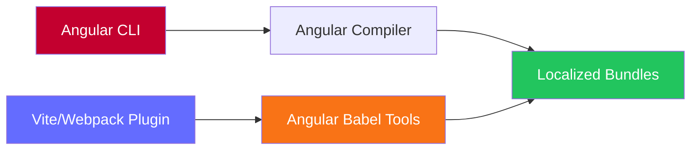

Modern products rarely live in one platform or framework. As monorepos grow, maintaining consistency becomes critical. My little <a href="https://github.com/edbzn/i18n-sandbox">i18n-sandbox</a> repo demonstrates a **unified i18n system** built on Angular's official `@angular/localize` - inspired by Rosa's approach - ensuring consistent transformation logic and shared conventions across the whole stack.

**Why unified matters**: In large monorepos with dozens of apps and services, ad-hoc i18n approaches lead to fragmentation. Different frameworks, different libraries, different key formats, different extraction tools - it becomes unmaintainable. By standardizing on `@angular/localize`, you get:
- **One API** (`$localize`) across all code
- **One transformation engine** (Angular's official Babel plugins)
- **One extraction pattern** (custom Nx executor)
- **One key format** for type safety and validation

This consistency is key when maintaining i18n across different teams, frameworks and platforms in a single monorepo.

## Using Angular's Babel tools beyond Angular CLI

Angular CLI provides first-class i18n support out of the box. Angular's **official Babel transformation tools** in `@angular/localize/tools` aren't tied to Angular itself. By integrating these tools into **Vite and Webpack** (or Rspack) via custom plugins, combined with custom Nx executors, we get the same i18n capabilities as Angular CLI - but **universally** across any framework (React, Qwik, Vue, Svelte) and any JavaScript runtime (browser or Node.js).



### Angular: native build-time localization

Angular uses the framework's built-in i18n system. Keys live in templates (via `i18n` attributes) or TypeScript (via `$localize`).

**How it works:**

1. **Build** → compile app with Angular CLI
2. **Extract** → run `extract-i18n`, emit JSON (or XLF/XLIFF)
3. **Build with localize** → compiler inlines translations, produces one bundle per locale

Example (template and TS):

```html
<!-- Template key with Angular i18n attribute -->
<h1 i18n="@@welcomeTitle">Welcome to Angular</h1>
```

```ts
// TypeScript key using $localize
const message = $localize`:@@currentLanguage:Current Language: English`;
```

project.json (Angular):

```json
{
  "name": "ng-app",
  "i18n": {
    "sourceLocale": "en",
    "locales": {
      "fr": {
        "translation": "apps/ng-app/src/i18n/fr.json"
      }
    }
  },
  "targets": {
    "extract-i18n": {
      "executor": "@angular/build:extract-i18n",
      "options": {
        "format": "json",
        "buildTarget": "ng-app:build",
        "outputPath": "apps/ng-app/src/i18n",
        "outFile": "en.json"
      }
    },
    "build": {
      "executor": "@angular/build:application",
      "options": {
        "localize": ["en", "fr"],
        "polyfills": ["@angular/localize/init"]
      }
    }
  }
}
```

<Note type="tip">Angular's native localization is **build-time only**: translations are extracted and inlined by the compiler, producing separate bundles per locale in <code>dist/apps/ng-app/browser/&#123;locale&#125;/</code>.</Note>

### Vite/Webpack plugins: Angular's tools for any framework

The Vite and Webpack plugins integrate Angular's official `@angular/localize/tools` Babel plugins into their respective build pipelines. This brings Angular CLI's i18n capabilities to **any framework** (React, Qwik, Vue, Svelte) on **any runtime** (browser or Node.js).

**How the transformation works:**

When you write:
```tsx
const title = $localize`:@@welcome.title:Welcome to React`;
```

The plugin transforms it using Angular's Babel tools:

1. **Load translations** - Parse JSON translation file using `SimpleJsonTranslationParser`
2. **Apply locale** - Use `makeLocalePlugin` to inline the target locale
3. **Replace `$localize`** - Use `makeEs2015TranslatePlugin` to replace the tagged template with the translated text

```ts
// Before transformation (source code)
const title = $localize`:@@welcome.title:Welcome to React`;

// After transformation (for locale 'fr')
const title = "Bienvenue sur React";
```

**Plugin implementation** (simplified):

```ts
// Both Vite and Webpack use the same approach
import {
  makeEs2015TranslatePlugin,
  makeLocalePlugin,
  SimpleJsonTranslationParser,
} from '@angular/localize/tools';

// 1. Load translations from JSON
const parser = new SimpleJsonTranslationParser();
const { translations } = parser.parse(translationFile, content);

// 2. Create Babel plugins
const babelPlugins = [
  makeLocalePlugin(locale, { localizeName: '$localize' }),
  makeEs2015TranslatePlugin(diagnostics, translations, {
    missingTranslation: 'warning',
  }),
];

// 3. Transform code with Babel
const result = await transformAsync(code, {
  filename: filePath,
  plugins: babelPlugins,
});
```

**Configuration:**

```ts
// vite.config.mts - Browser apps (React, Vue, Svelte...)
import { angularLocalize } from '@i18n-sandbox/i18n-vite';

export default defineConfig({
  plugins: [
    angularLocalize({
      translations: `./src/i18n/${process.env.LOCALE || 'en'}.json`,
      locale: process.env.LOCALE || 'en',
    }),
  ],
});
```

**Building for multiple locales:**

```json
// project.json - Run separate build per locale
{
  "targets": {
    "build": {
      "executor": "nx:run-commands",
      "options": {
        "commands": [
          "LOCALE=en nx build:en react-app",
          "LOCALE=fr nx build:fr react-app"
        ]
      }
    },
    "build:en": {
      "executor": "@nx/vite:build",
      "options": {
        "outputPath": "dist/apps/react-app/en"
      }
    },
    "build:fr": {
      "executor": "@nx/vite:build",
      "options": {
        "outputPath": "dist/apps/react-app/fr"
      }
    }
  }
}
```

Each build loads its own translation file, transforms all `$localize` calls, and outputs to a locale-specific directory.

**Loading translations at runtime:**

For ICU expressions (plurals/selects), translations need to be available at runtime:

```ts
// i18n-init.ts - Import and initialize translations
import { loadTranslations } from '@angular/localize';
import EN from './i18n/en.json';
import FR from './i18n/fr.json';

// Load translations based on current locale
const locale = getCurrentLocale(); // 'en' or 'fr' from URL
loadTranslations(locale === 'fr' ? FR.translations : EN.translations);
```

```json
// en.json - Translation file format
{
  "locale": "en",
  "translations": {
    "welcome.title": "Welcome to React",
    "itemsCount": "{VAR_PLURAL, plural, =0 {No items} =1 {One item} other {INTERPOLATION items}}"
  }
}
```

<Note type="tip">Simple translations are replaced at build time. ICU expressions use runtime evaluation via <code>loadTranslations()</code> for dynamic plural/select logic.</Note>

**Server apps with Webpack:**

```js
// webpack.config.js - Server apps (Nest, Express, Fastify...)
const AngularLocalizePlugin = require('@i18n-sandbox/i18n-webpack');

module.exports = {
  plugins: [
    new AngularLocalizePlugin({
      translationFile: `./src/i18n/${process.env.LOCALE || 'en'}.json`,
      useDynamicLocale: true, // Enable per-request locale switching
    }),
  ],
};
```

<Note type="tip">Both plugins use the <strong>exact same Angular Babel tools</strong>. The only difference: Vite integrates via the <code>transform</code> hook, Webpack via a custom loader.</Note>

## Shared extraction: one executor for all

A custom Nx executor (`@i18n-sandbox/i18n-tools:extract-translations`) scans source code for `$localize` patterns and generates JSON translation files:

```json
{
  "targets": {
    "extract-i18n": {
      "executor": "@i18n-sandbox/i18n-tools:extract-translations",
      "options": {
        "sourceRoot": "apps/my-app/src",
        "outputPath": "apps/my-app/src/i18n"
      }
    }
  }
}
```

Output format:
```json
{
  "locale": "en",
  "translations": {
    "welcome.title": "Welcome to React",
    "itemsCount": "{VAR_PLURAL, plural, =0 {No items} other {INTERPOLATION items}}"
  }
}
```

<Note type="tip">Angular can use native <code>extract-i18n</code> or the custom executor. Vite and Webpack <em>must</em> use the custom executor.</Note>

## ICU message format: runtime plurals and selects

All three platforms support ICU expressions for complex pluralization and selection logic. They all use Angular's transformation tools, with optional runtime evaluation.

**ICU pluralization example:**

```ts
// Source code
const msg = $localize`:@@itemsCount:{${count}:VAR_PLURAL:, plural, =0 {No items} =1 {One item} other {{${count}:INTERPOLATION:} items}}`;

// JSON translation
{
  "itemsCount": "{VAR_PLURAL, plural, =0 {No items} =1 {One item} other {INTERPOLATION items}}"
}
```

**How each platform handles ICU:**

**Angular**: Build-time only - `makeEs2015TranslatePlugin` fully evaluates and inlines ICU expressions into compiled code.

**Vite** (browser apps):
- **Dev**: `enableRuntimeICU: true` converts ICU to `$localize._icu()` runtime calls. Single build serves all locales via client routing.
- **Prod**: Build-time transformation. Separate optimized bundle per locale.

**Webpack** (server apps): `enableRuntimeICU: true` enables per-request ICU evaluation. Single bundle serves all locales dynamically.

**Runtime ICU evaluation** (Vite dev / Webpack server):

```ts
// Both plugins use a custom Babel plugin to transform ICU expressions
// From: $localize`:@@id:{count, plural, =0 {none} other {many}}`
// To:   $localize._icu('id', template, locale, { count })

// Runtime implementation uses Intl.PluralRules
($localize as any)._icu = (messageId, message, locale, values) => {
  const translations = getTranslations(locale);
  const translatedMsg = translations[messageId] || message;
  const icu = parseICUMessage(translatedMsg);
  return renderICUMessage(icu, values, locale); // Uses Intl.PluralRules
};
```

<Note type="warning">ICU expressions must use static keys. Dynamic keys like <code>\$localize`@@\${type}_title:…`</code> are not supported.</Note>

## Platform comparison

All three platforms use the same transformation engine but with different integration points:

| Feature | Angular | Vite (Browser) | Webpack (Server) |
|---------|---------|----------------|------------------|
| **Transformation** | `@angular/localize/tools` via Compiler | `@angular/localize/tools` via Babel | `@angular/localize/tools` via Babel |
| **Extraction** | Native `extract-i18n` | Custom Nx executor | Custom Nx executor |
| **Frameworks** | Angular only | React, Vue, Svelte, Qwik | Nest, Express, Fastify |
| **Dev mode** | Build per locale | Single build + client routing | Runtime locale switching |
| **Prod build** | Per-locale bundles | Per-locale bundles | Single bundle, all locales |
| **ICU runtime** | ❌ Build-time only | ✅ Dev mode | ✅ Per-request evaluation |

**Key format** (universal across all platforms):

```ts
// Same API everywhere
const title = $localize`:@@welcome.title:Welcome to the app`;
const items = $localize`:@@items.count:{${count}:VAR_PLURAL:, plural, =0 {No items} other {${count} items}}`;
```

## Why this matters

By using Angular's official Babel tools universally, you get:

- **One transformation engine** - no divergence between platforms
- **One extraction pattern** - consistent tooling across your monorepo
- **One key format** - compile-time safety and validation
- **Battle-tested infrastructure** - leveraging years of Angular production use

The custom Vite and Webpack plugins don't "replicate" Angular - they **use the same official tools**, ensuring consistency across any JavaScript framework or runtime.

<Note type="tip">Explore the full implementation at <a href="https://github.com/edbzn/i18n-sandbox">edbzn/i18n-sandbox</a></Note>
