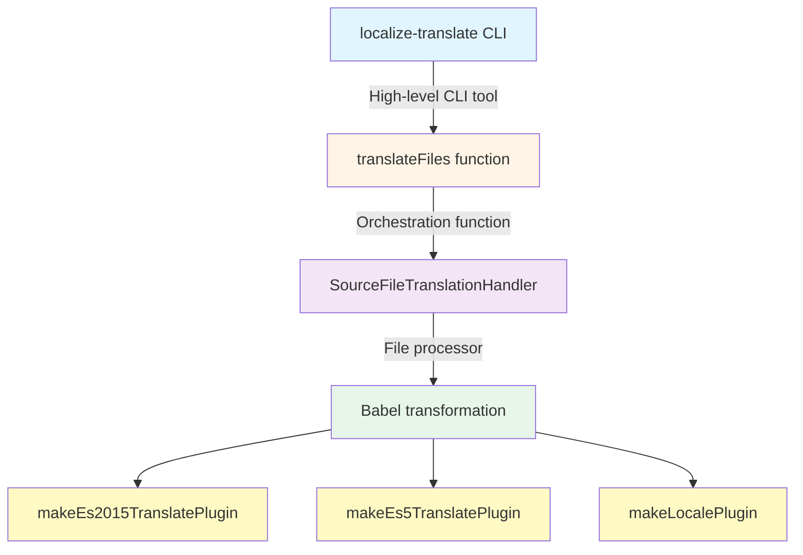

Recently, I worked on [Rosa](https://rosa.be)’s internationalization (i18n) system and wanted to share what I learned along the way.

Many tools offer i18n support, but maintaining consistency in large monorepos is essential. At Rosa, we standardized on Angular’s official `@angular/localize` tooling and use it everywhere, regardless of the **framework**.

**Why a unified approach matters**: In large monorepos with dozens of apps and libraries, ad-hoc i18n quickly becomes unmaintainable. Standardizing gives:

- **One API** (`$localize`)
- **One transformation engine** (Angular’s Babel plugins)
- **One extraction pattern** (Nx executor)
- **One key format** for type safety and validation

## What is Angular localize?

The package provides internationalization support using a `$localize` tagged template literal. It marks strings in your code that need translation:

```ts
const message = $localize`Hello, World!`;
```

### Processing scenarios

1. **Build-time (prod)**: Translations are inlined during the build process, producing separate bundles per locale.

```ts
// Source code
const message = $localize`${this.process} is not right`;

// After build-time translation (for French)
const message = '' + this.process + ", n'est pas bon. ";
```

<Note>Build-time translation brings runtime performance benefits by inlining translations and avoiding runtime overhead.</Note>

2. **Runtime**: Translations are loaded and evaluated at runtime, allowing language switching.

```ts
import '@angular/localize/init'; // Side-effect: attaches $localize to globalThis
import { loadTranslations } from '@angular/localize';

loadTranslations({
  greeting: 'Bonjour le monde!',
});

// Outputs 'Bonjour le monde!'
const message = $localize`:greeting:Hello, World!`;
```

<Note>Translations are processed only once, meaning that language switches require a browser refresh.</Note>

3. **Pass-through (dev mode)**: No translation loaded; `$localize` simply evaluates the original template string. This is what happens in development mode by default.

Now that we understand the basics, let's see how to integrate Angular localize with another framework.

## Angular's localize for any framework

Before diving into the integration, it's important to note that Angular's i18n tooling is **framework-agnostic** at its core. The transformation logic is encapsulated in Babel plugins provided by `@angular/localize/tools`.

When you write:

```tsx
const title = $localize`:@@welcome.title:Welcome to React`;
```

The transformation process follows this architecture:



1. **`localize-translate` CLI** <br/>
   Entry point for developers and Angular CLI. It parses arguments, loads translation files (XLF, JSON, etc.), resolves source files via globs, and triggers the translation process.

2. **`translateFiles()`** <br/>
   Orchestrates the workflow by selecting the right parsers, creating a `Translator` per locale, running translations in parallel, and collecting diagnostics.

3. **`SourceFileTranslationHandler`** <br/>
   Handles each source file individually: reads it from disk, parses it into an AST, applies locale-specific transformations, and writes the translated output to the correct directory.

4. **Babel transformation (core logic)** <br/>
   Translation happens via three Babel plugins:
   - **`makeLocalePlugin`** replaces `$localize.locale` with the concrete locale (e.g. `"fr-FR"`).
   - **`makeEs2015TranslatePlugin`** transforms `$localize` tagged templates into translated strings for modern JS syntax.
   - **`makeEs5TranslatePlugin`** handles the ES5 `$localize([...])` form emitted by downleveled TypeScript.

<Note type="tip">The beauty of this architecture is that **the same low-level Babel plugins** can be used in any build tool (Webpack, Vite, Rollup, Esbuild) to achieve consistent i18n transformations across frameworks.</Note>

## Integrating with Vite

Creating a Vite plugin is straightforward - it's just a matter of wiring Angular's Babel plugins into Vite's transform pipeline.

For **production builds with multiple locales**, the plugin generates separate bundles per locale:

```ts
import { transformAsync } from '@babel/core';
import {
  makeEs2015TranslatePlugin,
  makeEs5TranslatePlugin,
  makeLocalePlugin,
} from '@angular/localize/tools';

export function angularLocalize(options): Plugin {
  const locales = options.locales || [{ locale: 'en', translations: {} }];

  return {
    name: 'vite-plugin-angular-localize',

    async transform(code, id) {
      if (!code.includes('$localize')) return null;

      // In production, transform for each locale
      if (process.env.NODE_ENV === 'production') {
        const outputs = await Promise.all(
          locales.map(async ({ locale, translations }) => {
            const result = await transformAsync(code, {
              plugins: [
                makeLocalePlugin(locale),
                makeEs2015TranslatePlugin(diagnostics, translations),
                makeEs5TranslatePlugin(diagnostics, translations),
              ],
            });
            return { locale, code: result.code };
          })
        );

        // Vite will handle generating separate chunks per locale
        return outputs.find(o => o.locale === options.defaultLocale);
      }

      // In dev mode, use default locale only
      const result = await transformAsync(code, {
        plugins: [
          makeLocalePlugin(options.defaultLocale),
          makeEs2015TranslatePlugin(diagnostics, options.locales[0].translations),
          makeEs5TranslatePlugin(diagnostics, options.locales[0].translations),
        ],
      });

      return { code: result.code, map: result.map };
    },
  };
}
```

Usage:

```ts
// vite.config.ts
export default defineConfig({
  plugins: [
    react(),
    angularLocalize({
      defaultLocale: 'en',
      locales: [
        { locale: 'en', translations: {} },
        { locale: 'fr', translations: loadTranslations('./messages.fr.json') },
        { locale: 'de', translations: loadTranslations('./messages.de.json') },
      ],
    }),
  ],
});
```

**The result**: One codebase produces multiple locale-specific bundles at build time - `dist/en/`, `dist/fr/`, `dist/de/` - each with translations inlined for optimal runtime performance. The same three Babel plugins used by Angular CLI now power your React, Vue, or Svelte app.

## Why this matters

By using Angular's official Babel tools universally, you get:

- **One transformation engine** - no divergence between platforms
- **One extraction pattern** - consistent tooling across your monorepo
- **One key format** - compile-time safety and validation
- **Battle-tested infrastructure** - leveraging years of Angular production use

The custom Vite and Webpack plugins don't "replicate" Angular - they **use the same official tools**, ensuring consistency across any JavaScript framework or runtime.

<Note type="tip">Explore the full implementation at <a href="https://github.com/edbzn/i18n-sandbox">edbzn/i18n-sandbox</a>.</Note>
