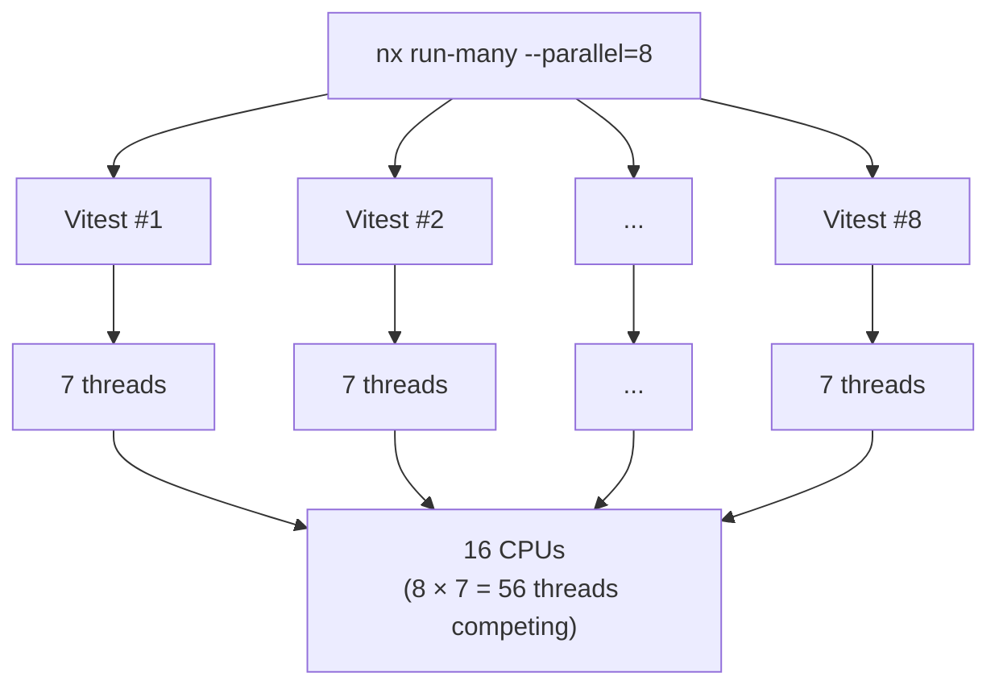

Increasing Nx's parallelism looks like a free speedup, but it's not as simple as it seems. Most modern build and test tools already parallelize internally, and Nx's parallel flag stacks on top of that. Past a certain threshold, you pay the cost of oversubscription without getting any speedup in return, and sometimes you actually regress.

## The setup

A synthetic Nx workspace with 96 packages (60 source files and 12 test files each), pinned to 16 logical CPUs via `taskset` to reflect a typical mid-tier CI runner. The build target calls esbuild directly, and the test target runs Vitest with its default inner thread pool of 7 workers. Each data point is a warmup run plus 3 measured runs, with the Nx cache disabled.

  <GitHubRepo name="edbzn/nx-parallelism-benchmark" />

I ran the benchmark on a Ryzen 9 9950X3D (16 physical cores, 32 threads) with 64 GB of RAM running Ubuntu 25.10.

## Results

### Build with esbuild, on 16 CPUs, 96 packages

<BenchChart
  title="nx run-many -t build (lower is better)"
  unit="ms"
  data={[
    { label: '--parallel=1',  value: 4807 },
    { label: '--parallel=2',  value: 3018 },
    { label: '--parallel=4',  value: 2061 },
    { label: '--parallel=8',  value: 1634 },
    { label: '--parallel=16', value: 1480, highlight: 'best' },
    { label: '--parallel=24', value: 1491 },
    { label: '--parallel=32', value: 1477, highlight: 'regression' },
  ]}
/>

The curve bends hard at parallel=16 and then flatlines. esbuild already saturates all 16 CPUs from inside a single process, so adding more Nx slots just duplicates work the Go runtime was going to do anyway. You pay RAM and scheduling overhead for no wall-clock win.

### Test with Vitest (inner pool of 7 threads, its default), on 16 CPUs, 96 packages

<BenchChart
  title="nx run-many -t test (lower is better)"
  unit="ms"
  data={[
    { label: '--parallel=1',  value: 38764 },
    { label: '--parallel=2',  value: 22124 },
    { label: '--parallel=4',  value: 15545 },
    { label: '--parallel=8',  value: 14552, highlight: 'best' },
    { label: '--parallel=16', value: 14780 },
    { label: '--parallel=24', value: 14960 },
    { label: '--parallel=32', value: 15051, highlight: 'regression' },
  ]}
/>

This one is worse than the build. Notice the sweet spot is at parallel=8, not 16, even though we have 16 CPUs: Vitest's own 7-thread pool already fills the machine. At parallel=8 we're running 8 × 7 = 56 threads on 16 cores, and that's already the optimum. Past there, the curve climbs back up monotonically and parallel=32 ends up ~3.5% slower than parallel=8, with 32 × 7 = 224 threads fighting over 16 cores.

<Note>These numbers come from a synthetic workspace. On a real large monorepo with hundreds of packages, heavier bundles and bigger test suites, the degradation past the sweet spot is typically steeper: more RAM pressure, more GC, and more process startup cost. Treat the shape of the curve as the signal, not the absolute percentages.</Note>

## Why it happens

When you set Nx's parallel flag to N, Nx launches N task processes at the same time. Each of those processes is a full tool invocation that then does its own thing:

- esbuild spawns a Go runtime that uses all available CPUs by default.
- Vitest and Jest spawn their own pool of worker threads or forked processes.
- tsc in build mode parses single-threaded but fans out I/O.
- Vite build is just Rollup plus esbuild under the hood, so same story.

Each outer slot is a fresh Node process that spins up its own worker pool. The CPUs at the bottom don't get more of themselves; they just get more guests fighting over the same seats.

## What to do instead

Think of parallelism as a budget split between two layers: Nx on the outside and the tool on the inside. On CI you get better, more predictable results by keeping the inner layer quiet and letting Nx schedule across tasks.

Pin the tool to a single worker and let Nx do the parallelization:

- **Jest**: `--runInBand` (runs all tests in the current process, no worker pool).
- **Vitest**: `--no-file-parallelism` (runs test files sequentially inside a single worker).
- **esbuild**: not really tunable, but since it's already CPU-bound inside its own process, dropping Nx's parallel value is usually the right lever.

With the inner pool pinned to 1, `--parallel=N` is the only knob that matters, and N ≈ your CPU count becomes a safe default. Measure from there.

Past a single machine's sweet spot, the next speedup comes from horizontal distribution (Nx Agents, Nx Cloud, CI matrix jobs), not from cranking a single-machine knob. Watch memory too: each extra slot holds another Node process in RAM, which is a common cause of CI OOM-kills.

<Note type="tip">On CI, start with `jest --runInBand` or `vitest --no-file-parallelism` and tune `--parallel` alone. One knob is easier to reason about than two.</Note>

## TL;DR

Nx's parallel flag doesn't compose with tool-level parallelism, it multiplies it. On CI, pin the tool to a single worker (`jest --runInBand`, `vitest --no-file-parallelism`) and let `--parallel` do the scheduling. Measure, don't guess.
