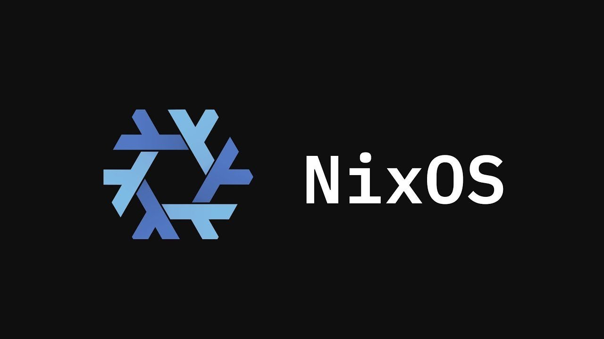

Le 8 avril 2026, la DINUM a organisé un [séminaire interministériel](https://www.numerique.gouv.fr/sinformer/espace-presse/souverainete-numerique-reduction-dependances-extra-europeennes/) pour accélérer la réduction des dépendances numériques extra-européennes de l'État. Parmi les annonces phares: **la sortie de Windows au profit de postes sous Linux**, la migration de 80 000 agents de la CNAM vers des outils souverains (Tchap, Visio, FranceTransfert), et la migration de la plateforme des données de santé vers une solution de confiance d'ici fin 2026.

Chaque ministère devra formaliser son propre plan de réduction des dépendances d'ici l'automne, couvrant le poste de travail, les outils collaboratifs, l'anti-virus, l'IA, les bases de données, la virtualisation et les équipements réseau.

David Amiel, ministre de l'Action et des Comptes publics:

> Nous devons nous désensibiliser des outils américains et reprendre le contrôle de notre destin numérique. La souveraineté numérique n'est pas une option.

## GendBuntu: la Gendarmerie sous Linux depuis 2008

La **Gendarmerie nationale** est la première institution à avoir engagé cette transition à grande échelle. Dès 2005, elle amorce sa migration vers les logiciels libres en déployant LibreOffice, Firefox et Thunderbird. En 2008, elle franchit le pas du système d'exploitation avec [GendBuntu](https://fr.wikipedia.org/wiki/GendBuntu), une distribution Ubuntu adaptée à ses besoins, développée en partenariat avec Canonical.

Aujourd'hui, **73 000 postes** répartis sur 4 300 sites tournent sous GendBuntu. Les économies réalisées sont estimées à **9 millions d'euros par an**, dont 2 millions de coûts de licence évités. Le déploiement couvre également les DROM-COM.

## Sécurix et Bureautix: l'approche NixOS de la DINUM

Le département de l'opérateur (OPI) de la DINUM maintient deux projets open source basés sur [NixOS](https://nixos.org/) pour le poste de travail.

**Sécurix** est un OS sécurisé pour les postes d'administration sensibles: noyau durci selon les [recommandations ANSSI](https://cyber.gouv.fr/publications/recommandations-de-securite-relatives-un-systeme-gnulinux), authentification TPM2/FIDO2, chiffrement via `age` ou Vault, et Secure Boot. **Bureautix** en est le dérivé bureautique, conçu pour être cloné et adapté par chaque organisation. Les utilisateurs sont gérés "as code" dans le dépôt Git, sans annuaire LDAP centralisé.

Grâce au modèle déclaratif de NixOS, chaque poste est défini par sa configuration Nix, ce qui permet un déploiement GitOps avec mises à jour atomiques et retour arrière garanti.

<GitHubRepoGrid>
<GitHubRepo name="cloud-gouv/securix" description="Base OS sécurisé pour postes d'administration, basé sur NixOS." />
<GitHubRepo name="cloud-gouv/bureautix-example" description="Dérivé bureautique de Sécurix avec inventaire, installeur et personnalisations." />
</GitHubRepoGrid>

## L'Éducation nationale et le contrat Microsoft

En mars 2026, [l'Éducation nationale a prolongé son contrat avec Microsoft](https://www.usine-digitale.fr/souverainete/souverainete-leducation-nationale-prolonge-son-contrat-avec-microsoft-pour-quatre-ans-malgre-les-recommandations-pour-limiter-lusage-des-solutions-americaines.47BWX6UIKJF4RC7HGZGXWELDJQ.html) jusqu'en **mars 2029**, via un accord-cadre attribué en mars 2025 pour un an puis reconductible tacitement trois fois.

Le marché, plafonné à **152 millions d'euros**, couvre près d'**un million de postes de travail et serveurs** pour l'Éducation nationale, l'Enseignement supérieur et plusieurs structures liées à la jeunesse, aux sports et à la vie associative.

Ce renouvellement s'inscrit dans un contexte où la doctrine « Cloud au centre » et la circulaire de février 2026 sur les achats numériques recommandent de privilégier des solutions offrant de meilleures garanties vis-à-vis des lois extraterritoriales comme le [CLOUD Act](https://fr.wikipedia.org/wiki/CLOUD_Act).

<Note>Le CLOUD Act est une loi fédérale américaine adoptée en 2018 qui permet aux autorités des États-Unis de contraindre les fournisseurs de services à fournir les données stockées sur leurs serveurs, y compris lorsqu'ils sont situés hors du territoire américain.</Note>
